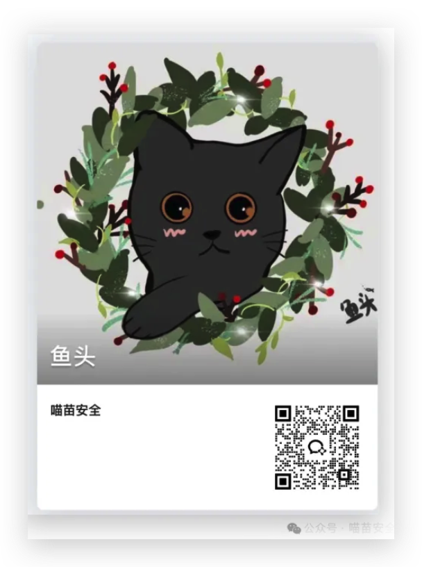

  <h1 align="center">🐳 云原生安全知识库</h1>

  

 
 
 

## 0x00 特别鸣谢

本项目受到 [Paper-Pen](https://github.com/Paper-Pen) 的 [GatherInfo](https://github.com/Paper-Pen/GatherInfo) 项目的启发，也希望大家多多支持 [Timeline Sec](https://github.com/TimelineSec) 💖

## 0x01 项目内容

- 📖 [书籍（7）](./books/README.md)
- 🛠️ [闭源工具（2）](./closed-source-tools/README.md)
- 📚 [文库博客（20）](./dynamic-document/README.md)
- 🏝 [靶场（13）](./labs/README.md)
- 🔍 [开源工具（27）](./open-source-tools/README.md)
- 📑 [论文报告（32）](./papers/README.md)
- 🥸 [演示文稿（14）](./slides/README.md)
- 📜 [静态文档（58）](./static-documents/README.md)
- 🌐 [公众号（3）](./wechat-public-account.md)
- ⏰ [云原生会议（3）](./conference/README.md)

## 0x02 如何使用

要开始使用 awesome-cloud-native-security 之前，请按照以下简明的步骤使用 ✨

- 🙋🏻‍♀️ ：我也有比较好用的工具、网站和案例可以分享。

    💁🏻‍♀️ ：提交 [PR](https://github.com/y4ney/InfoCollect/pulls)

- 🙋🏻‍♀️ ： 我想要收集某个信息，但是在这里找不到工具。

    💁🏻‍♀️：打开 [Discussion](https://github.com/y4ney/InfoCollect/discussions)

- 🙋🏻‍♀️ ：我发现了错误

    💁🏻‍♀️：提交 [Issues](https://github.com/y4ney/InfoCollect/issues)

- 🙋🏻‍♀️ ：我想转载

    💁🏻‍♀️ ： 请注明来源：[https://github.com/y4ney/awesome-cloud-native-security](https://github.com/y4ney/awesome-cloud-native-security)

## 0x03 交流

我们是一群专注于云原生安全的铲屎官 🐈🐈。

关注公众号：“喵苗安全”，加入我们 🎉🎉

若有任何问题，请联系我们的小猫咪客服 🐱🐱

如果你也有比较好用的工具或网站并且愿意分享，欢迎起来一起交流。

整理不易，如觉得有帮助，可以给个star支持一下，多谢！

## 0x04 Star曲线

## 信息源

- [Awesome-CloudSec-Labs](https://github.com/iknowjason/Awesome-CloudSec-Labs)
